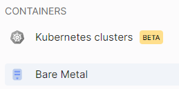
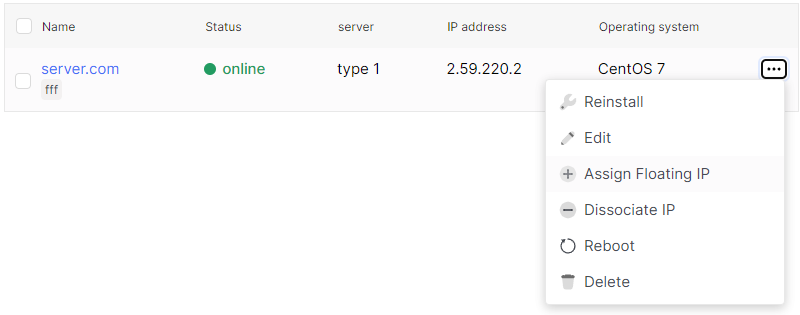
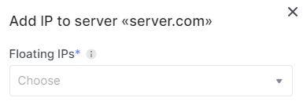

# Assign Floating IP

1. Go to the **Bare Metal** section.

2. Select the desired server, click on the ellipsis in the server field, and choose **Assign Floating IP** from the context menu.

3. Choice floating IP for server from specified list in field named **Floating IPs**.

4. Click **add IP** when choice necessary floating IP.

#### You can do it in server detail page if click  on the ellipsis with **Menu** name in the top right corner.

