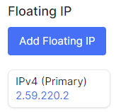

## List of floating IPs

1. Go to the **Bare Metal** section.

2. Select the desired server, click on the server name.

3. In this page display all associated floating IPs.

 
 
 
 
 

## Assign Floating IP in detail server page

1. Go to the **Bare Metal** section.

2. Select the desired server, click on the server name.

3. Click **Add Floating IP**.

4. Choice floating IP for server from specified list in field named **Floating IPs**.

5. Click **add IP** when choice necessary floating IP.

 
 
 
 
 

## Dissociate Floating IP in detail server page

1. Go to the **Bare Metal** section.

2. Select the desired server, click on the server name.

3. Select the desired floating IP, click on the ellipsis in the server field, and choose **Dissociate IP** from the context menu.

4. Click **Yes** for dissociate IP.

