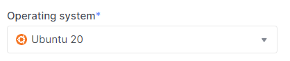

# Create a Bare Metal server

1. Go to the **Bare Metal** section.

2. Click on **Create Bare Metal server**.

 
 
 
 
 

## Configure Bare Metal Server

1. Enter the name of the future Bare Metal server to **Name of Server** field.

2. Choice server from specified of free servers in table below previous field.

3. Choice OS for server from specified list in field named **Operating system**.

4. Choice disk layout for server from specified list in field named **Disk Layout**. The display disk layouts in list depends of disk count on server.

5. Set root password in **Root password** field.

6. Set tags in **Tags** field. Use space for complete input tag.

7. Make sure you have filled in all the required fields, then click **Continue**.

 
 
 
 
 

## Network Settings

1. You can choose, create, add ssh key.

2. Make sure that you choose need ssh key if you want to add ssh key, then click **Continue**.

 
 
 
 
 

## Full create info

1. In this page display all info about your choice during creating Bare Metal server.

2. Make sure you have filled in all the required fields, then click **Continue**.

