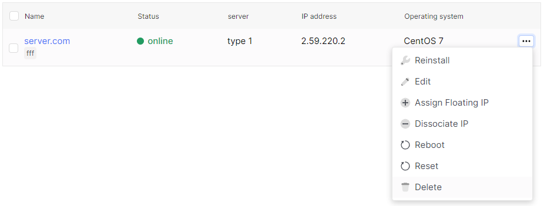
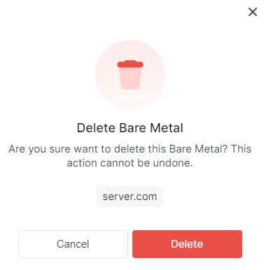

# Delete Bare Metal server

1. Go to the section **Bare Metal**.

2. Select the desired server, click on the ellipsis in the server field, and choose **Delete** from the context menu.

3. In the deletion window, click **Delete**.

