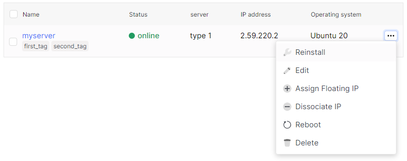
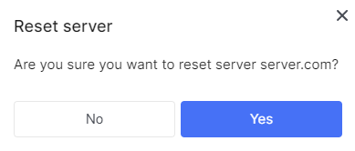
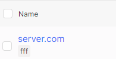
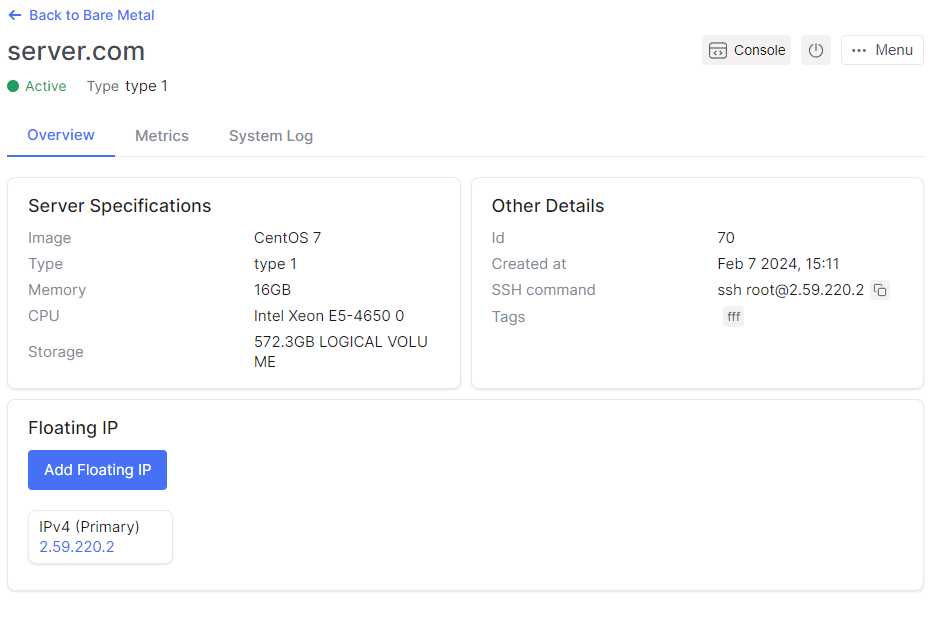
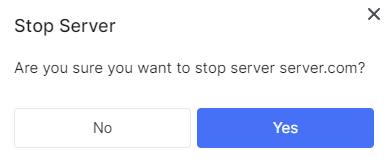
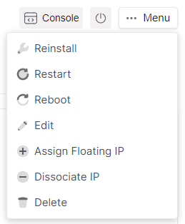

# Reinstall

1. Go to the **Bare Metal** section.

2. Select the desired server, click on the ellipsis in the server field, and choose **Reinstall** from the context menu.

3. Choice OS for server from specified list in field named **Operating system**.

4. Choice disk layout for server from specified list in field named **Disk Layout**. The display disk layouts in list depends of disk count on server.

5. You can also choose ssh key.

6. After making all the necessary changes, click **Rebuild**.

 
 
 
 
 

## Edit

1. Go to the **Bare Metal** section.

2. Select the desired server, click on the ellipsis in the server field, and choose **Edit** from the context menu.

3. You can change server hostname in **Name** field.

4. You can add or delete tag in **Tags** field.

5. Click **Rename** when made all necessary changes.

 
 
 
 
 

## Reboot

1. Go to the **Bare Metal** section.

2. Select the desired server, click on the ellipsis in the server field, and choose **Reboot** from the context menu.

3. Click **Yes** if you want reboot server.

 
 
 
 
 

## Reset

1. Go to the **Bare Metal** section.

2. Select the desired server, click on the ellipsis in the server field, and choose **Reset** from the context menu.

3. Click **Yes** if you want reset server.

 
 
 
 
 

## Stop

1. Go to the **Bare Metal** section.

2. Select the desired server, click on the server name.

3. On the server detail page, there is a button **Power** in the top right corner.

4. Click **Power** button.

5. Click **Yes** for stop server.

 
 
 
 
 

## Start

1. Go to the **Bare Metal** section.

2. Select the desired server, click on the server name.

3. On the server detail page, there is a button **Power** in the top right corner.

4. Click **Power** button.

5. Click **Yes** for stop server.

 
 
 
 
 

## Edit server from detail page

1. Go to the **Bare Metal** section.

2. Select the desired server, click on the server name.

3. You can do all of this action in server detail page if click  on the ellipsis with **Menu** name in the top right corner.

