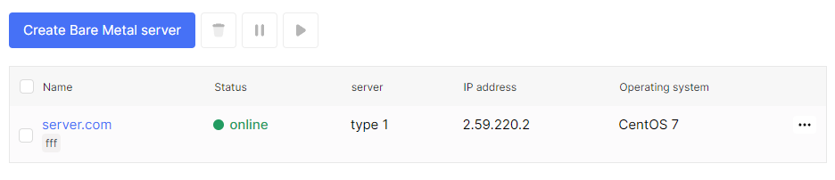

## Bare Metal server metrics

1. Go to the **Bare Metal** section.

2. Select the desired server, click on the server name.

3. In this page display all associated floating IPs.

4. Select **Metrics** tab.

5. The graph display **Network Metrics** by 24 hours, 14 days, 30 days, all period. 

6. You can get combined monthly data in **Breakdown**.

