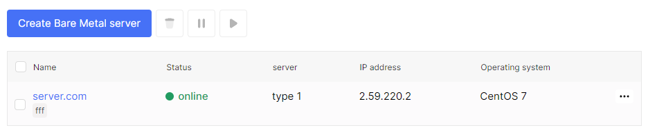
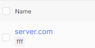
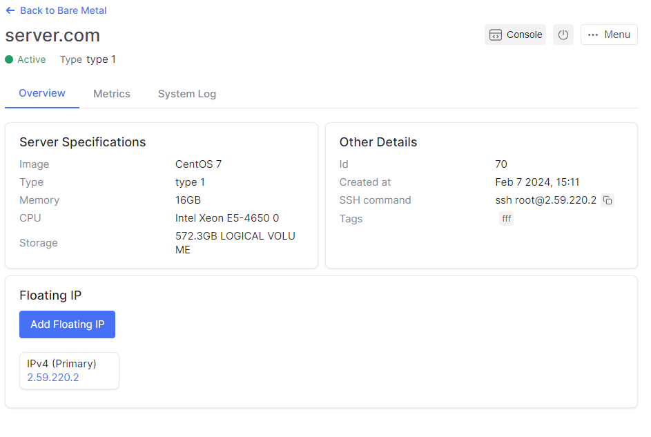

# Reinstall

1. Go to the **Bare Metal** section.

2. Select the desired server, click on the server name.

3. On the server detail page, there is a button **Console** in the top right corner.

4. Click **Console** and wait when you will redirection to console web tab.

