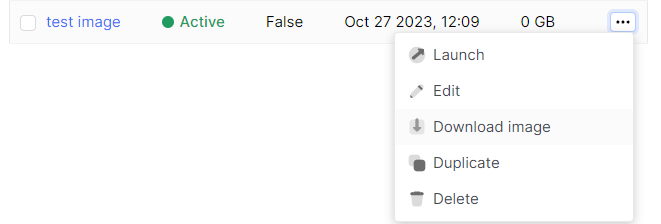

# Download (Export) Image

import Tabs from '@theme/Tabs';
import TabItem from '@theme/TabItem';

<Tabs>
  <TabItem value="personal-area" label="Personal Area" default>

1. Select the desired image, click on the ellipsis in the image field, and choose **Download image** from the context menu.



2. Wait for the image to finish download.

</TabItem>
<TabItem value="openstack" label="Openstack CLI">

Ensure that the OpenStack client is installed and you are able to authenticate to use it. Execute the necessary commands.

```
openstack image save <image-name>
```

</TabItem>
</Tabs>
