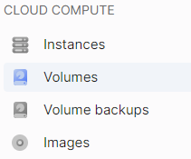
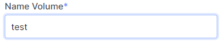
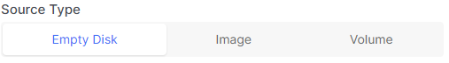
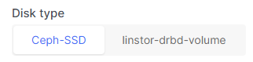
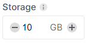

# Create a Volume

You can create a network volume together with an instance or create it separately and then attach it to an instance.

A local volume is created only when an instance is created.

A network volume can be created from different sources:

- **Empty**: Initially, this type of volume does not contain any data. You can use it to scale the storage space in an instance.
- **From an image**: Prepared by OneCloudPlanet or your own uploaded image. You can use this for replacing the boot volume during instance recovery or for cloning instances.
- **From another volume, snapshot, or backup**: To create a copy of an existing volume.

The cost of a network volume depends on its [type](#). You can calculate the cost during instance creation.

import Tabs from '@theme/Tabs';
import TabItem from '@theme/TabItem';

<Tabs>
 <TabItem value="personal-area" label="Personal Area" default>

On the OneCloudPlanet platform, you can change the instance type, which includes the number of processors (vCPU) and the amount of RAM.

1. Go to **Volumes**.



2. Click Create Volume.


3. Enter the volume name.



4. Select the volume source (ready-made image, your image, a volume, snapshot, or backup). If you need to create an empty volume, skip this step.



5. Choose the volume type. Volume differ in read/write speed and throughput values.



6. Specify the volume size in GB. The size of a volume created from a source should be equal to or greater than the source size. We recommend not exceeding the maximum volume size limits. After creating a volume, you won't be able to decrease its size directly.



7. Click Create.


</TabItem>
<TabItem value="openstack" label="Openstack CLI">

Make sure the OpenStack client is [installed](#) and you can [authenticate](#) to use it.
Execute the required command:
Create a network volume:

```
    openstack volume create
    [--image <image> | --snapshot <snapshot> | --source <volume>] \
    --size <size> \
    --type <volume_type> \
    [--availability-zone <new_zone>] \
    <volume_name>
```

Specify the source type:

- `--image <image>` - to create a volume from an image. The `<image>` - parameter is the name or ID of the image, which you can view using `openstack image list`
- `--snapshot <snapshot>` - to create a volume from a snapshot. The `<snapshot>` - parameter is the name or ID of the snapshot, which you can view using `openstack volume snapshot list`
- `--source <volume>` - to create a volume from another volume. The `<volume>` - parameter is the name or ID of the volume, which you can view using `openstack volume snapshot list`

- `--size <size>` - volume size in GB. For volumes created from a source, the minimum size should be equal to the source size. Consider the [volume limits](/control-panel/cloud-platform/compute/volumes/volume-type#limits) for the maximum volume size;
- `--type <volume_type>` - volume type. volume types differ in throughput values and read/write speeds. You can view the available types using `openstack volume type list`
- `--<volume_type>` - volume name.

</TabItem> 
</Tabs>