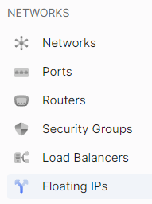
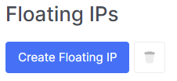
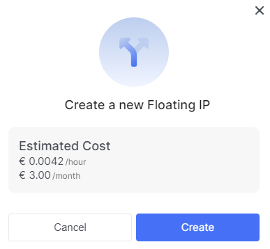
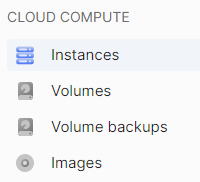
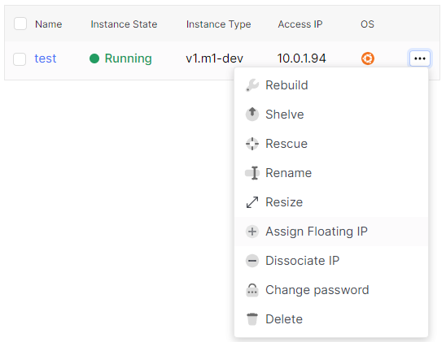
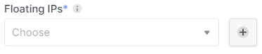

# Creating floating IP

 

## Creating **Floating IPs**.

1. Creating Floating IPs in the **Floating IPs** section.

2. Click the **Create floating IP address** button.

3. Confirm the creation of the floating IP address after reviewing the pricing policy.

 

## Creating Floating IPs in the **Instances** section.
1. Using the sidebar, navigate to the **Instances** section.

2. Use the ellipsis (...) in the instance field to expand the context menu for interacting with the instance. In the context menu, select the **assign floating IP address** section.

4. By using the "+" symbol next to the dropdown field labeled **floating IPs**, create a new floating IP address.

5. Wait for a notification of the successful creation of the floating IP address.

