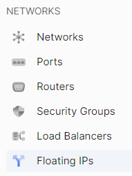
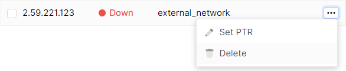
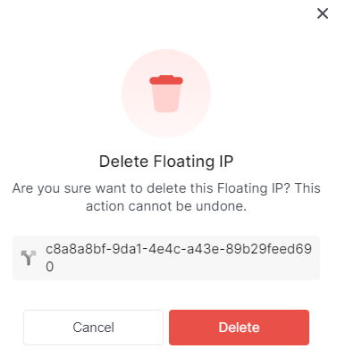
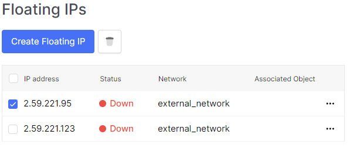
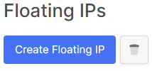

# Delete floating IPs

 

## The first method to delete floating IPs.
1. Using the sidebar, navigate to the **Floating IPs** section.

2. In the floating IP address field, click on the ellipsis (...). In the context menu, select the **Delete** section.

3. In the confirmation window, click the **Delete** button.

 

##  The second, bulk, method to delete floating IPs.
1. Using the sidebar, navigate to the **Floating IPs** section.

2. In the floating IP address field, click on the checkbox (the first clickable object in the IP address field).

4. Use the button with the trash can icon next to the **Create floating IP address** button.

