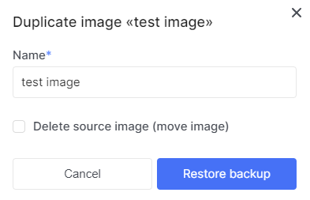

# Create image

import Tabs from '@theme/Tabs';
import TabItem from '@theme/TabItem';

<Tabs>
   <TabItem value="personal-area" label="Personal Area" default>

1. Go to the **Images** section.


2. Click on **Create Image**.


3. Enter the name of the future image in the field labeled **Name Image**.


4. Choose the **image format** for the future image from the format field.


5. Choose the source type for image creation.

    5.1. Create an image by specifying a source URL.

    
    
    5.2. Create an image by uploading a disk file.
    
    

6. (Optional) You can further customize the image. Click on **Additional Settings**.


7. Choose the operating system that will be associated with the image in the **Operating system** field.


8. You can also enter the version that will be associated with the image in the **OS version** field.


9. Specify the minimum disk size.


10. Specify the minimum RAM size.


   </TabItem>
   <TabItem value="openstack" label="Openstack CLI">

   Make sure that the OpenStack client is installed and you are able to authenticate to use it. Execute the necessary commands.

   ```
   openstack image create
   --disk-format <disk-format> /
   --min-disk <disk-gb> /
   --min-ram <ram-mb> /
   --file <file> | --volume <volume>
   <image-name>
   ```

   `--disk-format <disk-format>` - Image disk format. The supported options are: ami, ari, aki, vhd, vmdk, raw, qcow2, vdi, iso. The default format is: raw.

   `--min-disk <disk-gb>` - Minimum disk size needed to boot image, in gigabytes.

   `--min-ram <ram-mb>` - Minimum RAM size needed to boot image, in megabytes.

   `--file <file>` - Upload image from local file.

   </TabItem>
</Tabs>

# Creating an Image from a **Volume**

<Tabs>
<TabItem value="personal-area" label="Personal Area" default>

1. Go to the **Volumes** section.


2. Select the required disk, click on the ellipsis in the disk field, and choose **Upload to image** from the context menu.


3. Enter the image name in the **Name** field.


4. Choose the image format in the **Image format** field.


5. After filling in the details, click **Create**.


</TabItem>
 <TabItem value="openstack" label="Openstack CLI">

Make sure that the OpenStack client is installed and you are able to authenticate to use it. Execute the necessary commands.

   
```
openstack image create --disk-format <disk-format> --volume <volume> <image-name>
```

`--disk-format <disk-format>` - Image disk format. The supported options are: ami, ari, aki, vhd, vmdk, raw, qcow2, vdi, iso. The default format is: raw.

`--volume <volume>` - Create image from a volume.

</TabItem>
</Tabs>


# Create image by duplicate an exist one image

1. Select the desired image, click on the ellipsis in the image field, and choose **Duplicate** from the context menu.


2. Enter the name of the future image in the **Name** field.



3. (Optional) Check the box with the description: **Delete the source image(move image)** to implement moving the image.


4. Click on **Restore image**


