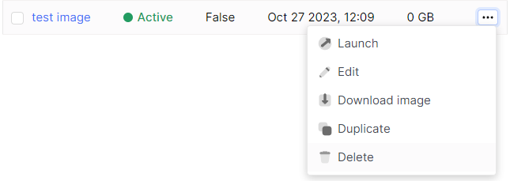
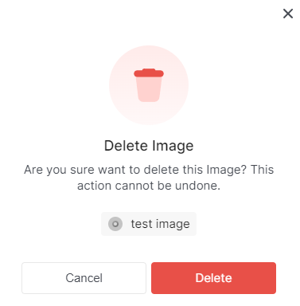

# Delete Image

import Tabs from '@theme/Tabs';
import TabItem from '@theme/TabItem';

<Tabs>
  <TabItem value="personal-area" label="Personal Area" default>

1. Select the image you want to delete, click on the ellipsis in the image field, and choose **Delete** from the context menu.



2. Click the **Delete** button.



</TabItem>
<TabItem value="openstack" label="Openstack CLI">

Make sure that the OpenStack client is installed and you are able to authenticate to use it. Execute the necessary commands.

```
openstack image delete <image-name>
```

</TabItem>
</Tabs>
