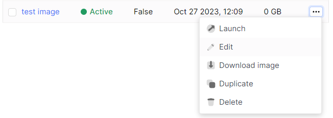
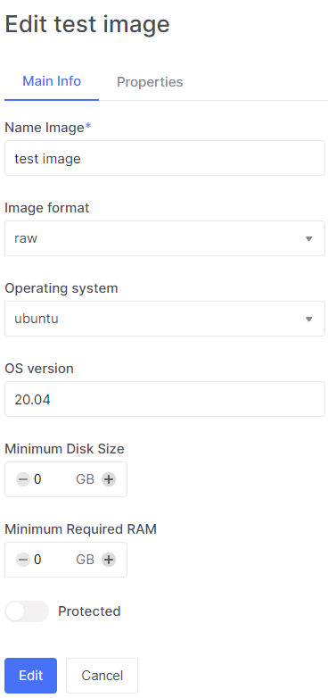
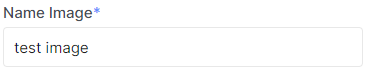
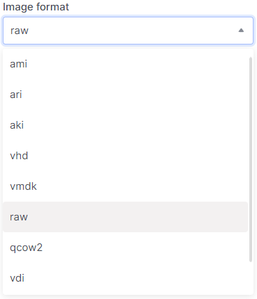
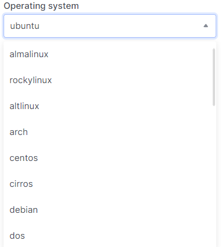
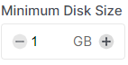
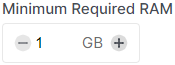

# Edit Image

import Tabs from '@theme/Tabs';
import TabItem from '@theme/TabItem';

<Tabs>
  <TabItem value="personal-area" label="Personal Area" default>
    
1. Select the desired image, click on the ellipsis in the image field, and choose **Edit** from the context menu.



2. In the **Basic Information** section, you can edit the essential details.

    

    2.1. Enter a new name in the **Name Image** field for editing.

    
 
    2.2. Choose a different image format in the **Image format** field for editing.

    

    2.3. Select a different operating system version in the **OS version** field.

    

    2.4. Choose the minimum disk size.

    

    2.5. Select the minimum RAM size.

    

    2.6. You can protect your image from deletion by enabling the **Protected** option.

    

    2.7. Click **Edit**.

    

</TabItem>
<TabItem value="openstack" label="Openstack CLI">
    
Make sure that the OpenStack client is installed and you can authenticate to use it. Execute the necessary commands.

```
openstack image set --name <name>
                    --min-disk <disk-gb>
                    --min-ram <ram-mb>
                    --disk-format <disk-format>
                    --os-distro <os-distro>
                    --os-version <os-version>
                    <image-name>
```

`--name <name>` - New image name

`--disk-format <disk-format>` - Image disk format. The supported options are: ami, ari, aki, vhd, vmdk, raw, qcow2, vdi, iso. The default format is: raw.

`--min-disk <disk-gb>` - Minimum disk size needed to boot image, in gigabytes.

`--min-ram <ram-mb>` - Minimum RAM size needed to boot image, in megabytes.

`--os-distro <os-distro>` - Operating system distribution name.

`--os-version <os-version>` - Operating system distribution version.

`--protected` - Operating system distribution version.

</TabItem>
</Tabs>