# Create an instance

The account balance must be positive and the [quota](#) must be sufficient to create the desired instance configuration.

## Available OS

The OneCloudPlanet team prepared images of some OSes. The list of ready-made images is available in your account in the window for creating a new virtual machine.

If necessary, you can import the OS image yourself.

## Create an instance

### 1. Configure Instance

1. Go to the **Instances**.

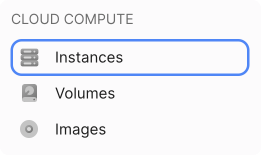

2. Click **Create Instance**.

3. Enter the name of the instance. It will be set as the hostname in the operating system on the server. Use only latin letters, numbers or symbols `-`, `_` and `.`.

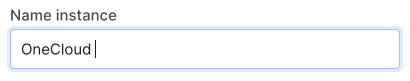

4. Create a password for the `root` user (a user with unlimited rights to all actions on the system) to connect to the server.

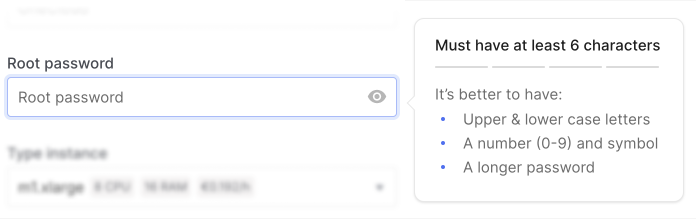

5. Select a preset Instance configuration (CPU and RAM). Read more in the overview of [configurations](#).

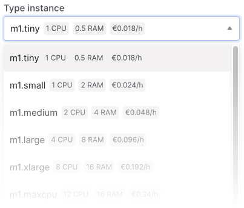

6. Select the operation system version or the image you created earlier.

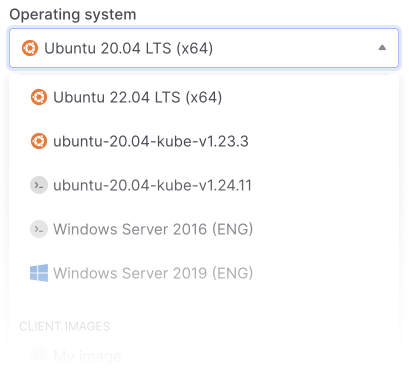

7. Select the boot (system) disk of the server:

- **Local Storage** - disk size will depend on the configuration. A server with a local disk can only be created from a ready-made or custom image.

- **Volume** - In the Disk type field, select the type of disk and specify its size.

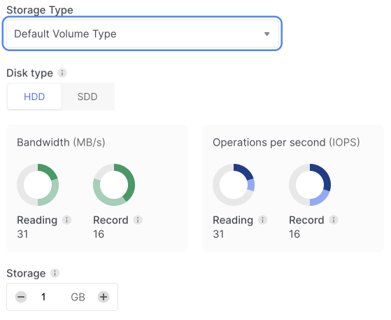

Once the server is created, only the network boot drive can be replaced.

8. Select the number of instances to create.

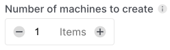

9. Click **Continue**.

### 2. Network Settings

10. Select an existing network or create a new one. When you select **Create a new network**, a network and a subnet in it are automatically created.

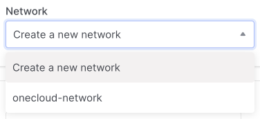

11. Instance Key: Select a key to connect via SSH or create a new one.

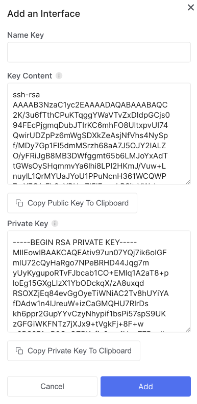

12. If you select Create a new key, after creating it, you need to select it in the list of SSH keys. To make it appear, click the **Refresh list** button.

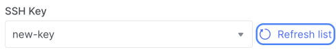

13. Click **Continue**.

14. At the last stage, check the settings of the instance and the network.

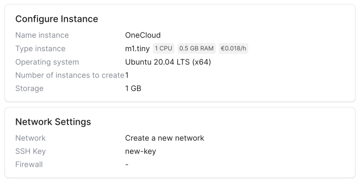

14. Click **Create**.

