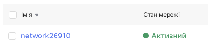
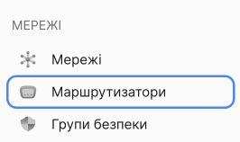
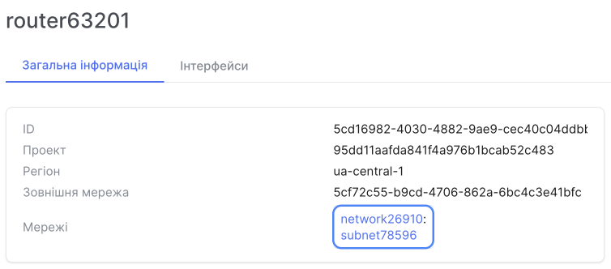
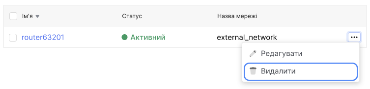
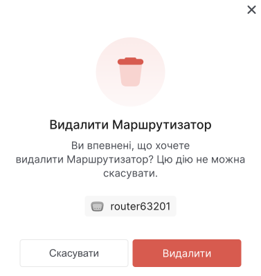
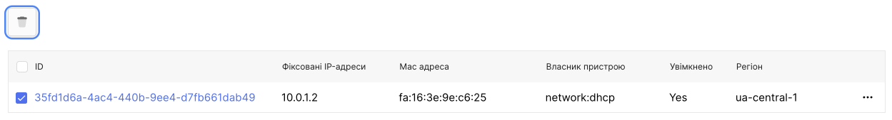
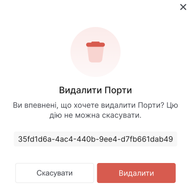
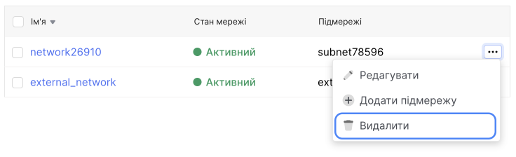
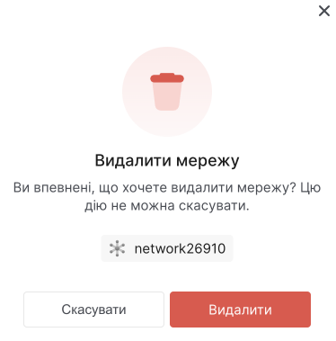

# Видалення мережі

Для того, щоб видалити мережу, потрібно спочатку видалити прихильність до інтерфейсів в маршутизаторах, маршутизатори, порти в мережах і тільки потім мережу.

1. Перейдіть до **Мережі**.

Буде відображено список мереж. Запам'ятайте назву мережі, яку потрібно видалити.

## Видалення інтерфейсів у маршутизаторі

2. Перейдіть до **Маршутизатори**.

У списку натисніть назву маршутизатора, який прикріплений до мережі.

Відкриється сторінка з детальною інформацією про маршутизатор. У тому числі буде відображена мережа до якого прикріплений маршутизатор. 

3. Перейдіть на вкладку **Інтерфейси**.

4. Виберіть усі інтерфейси в цьому маршутизаторі та натисніть кнопку **Видалити**.

5. У модальному вікні натисніть кнопку **Видалити**.

## Видалення маршутизатора

6. Повертаємося до списку маршутизаторів та в контекстному меню потрібного маршутизатора вибираємо дію **Видалити**.

7. У модальному вікні натисніть кнопку **Видалити**.

## Видалення портів в мережі

8. Повертаємося до списку мереж та натисніть назву мережі, яку потрібно видалити.

9. Перейдіть на вкладку **Порти**. 

10. Виберіть усі порти в цій мережі та натисніть кнопку **Видалити**.

11. У модальному вікні натисніть кнопку **Видалити**.

## Видалення мережі

12. Повертаємося до списку мереж та в контекстному меню потрібною мережи вибираємо дію **Видалити**.

13. У модальному вікні натисніть кнопку **Видалити**.

