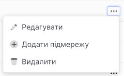
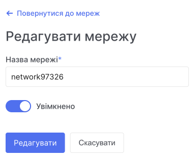

# Editing a network

1. Go to **Networks**.

**Using the context menu:**

- In the list of networks, find the network you want to edit.

- Expand the context menu of the network.

- Select the **Edit** action.

You can change the name and status of the network.