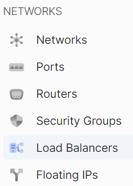
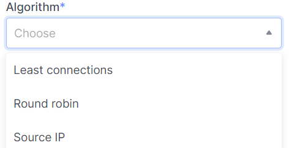

# Creating a Load Balancer

1. Go to the **Load Balancers** section.



2. Click on **Create Load Balancer**.


### Load Balancing Information

import Tabs from '@theme/Tabs';
import TabItem from '@theme/TabItem';

<Tabs>
<TabItem value="personal-area" label="Personal Area" default>

1. Enter the name of the future load balancer in the **Name Load Balancer** field.


2. You can specify an IP address in the **IP address** field.


3. Add a description for the load balancer if needed.


4. Choice **Subnet**.


6. You can also change the activity status ("enabled" or "disabled") of the load balancer.


7. Make sure you have filled in all the required fields, then click **Continue**.


</TabItem>
<TabItem value="openstack" label="Openstack CLI">

Make sure the OpenStack client is [installed](#) and you can [authenticate](#) to use it.
Execute the required commands.

```
openstack loadbalancer create --name <name> / 
                              --description <description>
                              --vip-subnet-id <vip_subnet_id>
                              --enable | --disable
```

`--name <name>` - New load balancer name.

`--description <description>` - Set load balancer description.

`--vip-subnet-id <vip_subnet_id>` - Set subnet for the load balancer (name or ID).

`--enable` - Enable load balancer (default).

`--disable` - Disable load balancer.

</TabItem>
</Tabs>

### Listener Information

<Tabs>
<TabItem value="personal-area" label="Personal Area" default>

1. Enter the name of the listener in the **Name** field.


2. Describe the listener if necessary.


3. Choose the protocol for listening and enter the port you plan to listen on.


4. You can also edit additional settings by clicking on **Additional Settings** and changing the provided data to what you need.


5. Make sure you have filled in all the required fields, then click **Continue**.


</TabItem>
<TabItem value="openstack" label="Openstack CLI">

Make sure the OpenStack client is [installed](#) and you can [authenticate](#) to use it.
Execute the required commands.

```
openstack loadbalancer listener create
    --description <description> /
    --protocol {TCP,HTTP,HTTPS,TERMINATED_HTTPS} /
    --connection-limit <limit> /
    --default-pool <pool> /
    --default-tls-container-ref <container-ref> /
    --sni-container-refs [<container-ref> [<container-ref> ...]] /
    --insert-headers <header=value,...> /
    --protocol-port <port> /
    --enable | --disable /
    <load_balancer>
```

`--name <name>` - Set listener name.

`--description <description>` - Set the description of this listener.

`--protocol {TCP,HTTP,HTTPS,TERMINATED_HTTPS}` - The protocol for the listener.

`--connection-limit <limit>` - The maximum number of connections permitted for this listener.

`--default-pool <pool>` - The name or ID of the pool used by the listener if no L7 policies match.

`--default-tls-container-ref <container-ref>` - The URI to the key manager service secrets container containing the certificate and key for TERMINATED_TLS listeners.

`--sni-container-refs [<container-ref> [<container-ref> ...]]` - A list of URIs to the key manager service secrets containers containing the certificates and keys for TERMINATED_TLS the listener using Server Name Indication.

`--insert-headers <header=value,...>` - A dictionary of optional headers to insert into the request before it is sent to the backend member.

`--protocol-port <port>` - Set the protocol port number for the listener.

`--enable` - Enable listener (default).

`--disable` - Disable listener.

`<load_balancer>` - Load balancer for the listener (name or ID).

</TabItem>
</Tabs>

### Pool Details

<Tabs>
<TabItem value="personal-area" label="Personal Area" default>

1. Enter the name of the pool.


2. If needed, add a description for your pool.


3. Choose an algorithm for load distribution.



4. Complete the data for load distribution settings in the **Session Precentile** field.


5. You can also change the activity status ("enabled" or "disabled") of the pool.


</TabItem>
<TabItem value="openstack" label="Openstack CLI">

Make sure the OpenStack client is [installed](#) and you can [authenticate](#) to use it.
Execute the required commands.

```
openstack loadbalancer pool create    
    --name <name> /
    --description <description> /
    --protocol {TCP,HTTP,HTTPS,TERMINATED_HTTPS,PROXY} /
    --listener <listener> /
    --loadbalancer <load_balancer> /
    --session-persistence <session persistence> /
    --lb-algorithm {SOURCE_IP,ROUND_ROBIN,LEAST_CONNECTIONS} /
    --enable | --disable /
```

`--name <name>` - Set pool name.

`--description <description>` - Set pool description.

`--protocol {TCP,HTTP,HTTPS,TERMINATED_HTTPS,PROXY}` - Set the pool protocol.

`--listener <listener>` - Listener to add the pool to (name or ID).

`--loadbalancer <load_balancer>` - Load balancer to add the pool to (name or ID).

`--session-persistence <session persistence>` - Set the session persistence for the listener (key=value).

`--lb-algorithm {SOURCE_IP,ROUND_ROBIN,LEAST_CONNECTIONS}` - Load balancing algorithm to use.

`--enable` - Enable pool (default).

`--disable` - Disable pool.

</TabItem>
</Tabs>


### Pool Members

<Tabs>
<TabItem value="personal-area" label="Personal Area" default>

- You can add pool members manually by clicking **Add External Member** and filling in all the required fields.

   

- You can also add your instances as pool members.

  1.) Click on **Add Existing Instances**
  
  2.) From the listed instances, select the one you need and click **Add** in that instance's field.
      
  3.) Fill in the remaining fields.   
      


</TabItem>
<TabItem value="openstack" label="Openstack CLI">

Make sure the OpenStack client is [installed](#) and you can [authenticate](#) to use it.
Execute the required commands.

```
openstack loadbalancer member create --name <name>
                                     --weight <weight>
                                     --address <ip_address>
                                     --subnet-id <subnet_id>
                                     --protocol-port <protocol_port>
                                     --monitor-port <monitor_port>
                                     --monitor-address <monitor_address>
                                     --enable | --disable
                                     <pool>
```

`--name <name>` - Set the name of the member.

`--weight <weight>` - The weight of a member determines the portion of requests or connections it services compared to the other members of the pool.

`--address <ip_address>` - The IP address of the backend member server.

`--subnet-id <subnet_id>` - The subnet ID the member service is accessible from.

`--protocol-port <protocol_port>` - The protocol port number the backend member server is listening on.

`--monitor-port <monitor_port>` - An alternate protocol port used for health monitoring a backend member.

`--monitor-address <monitor_address>` - An alternate IP address used for health monitoring a backend member.

`--enable` - Enable member (default).

`--disable` - Disable member.

`<pool>` - ID or name of the pool to create the member for.

</TabItem>
</Tabs>


### Detailed Monitoring

<Tabs>
<TabItem value="personal-area" label="Personal Area" default>

1. Enter the name of the detailed monitoring settings in the **Name** field.

   

2. Choose the protocol in the **Type** field.

    

3. If necessary, fill in additional fields related to the protocol, in our case, the request method in the **HTTP method** field.
 
    

4. Select the correct response code.

   

5. Correct the URL to be monitored.

   

6. Specify the maximum allowed check errors before changing the member's operational status to **ERROR** and set the timeout.

   

7. The number of successful checks before changing the member's operational status to **ONLINE** and the delay between requests.

   

8. You can also change the activity status ("enabled" or "disabled") of monitoring.

   


</TabItem>
<TabItem value="openstack" label="Openstack CLI">

Make sure the OpenStack client is [installed](#) and you can [authenticate](#) to use it.
Execute the required commands.

```
openstack loadbalancer healthmonitor create
    --name <name>
    --delay <delay>
    --expected-codes <codes>
    --http_method {GET,POST,DELETE,PUT,HEAD,OPTIONS,PATCH,CONNECT,TRACE}
    --timeout <timeout>
    --max-retries <max_retries>
    --url-path <url_path>
    --type {PING,HTTP,TCP,HTTPS,TLS-HELLO}
    --max-retries-down <max_retries_down>
    --enable | --disable
    <pool>
```

`--name <name>` - Set the health monitor name.

`--delay <delay>` - Set the time in seconds, between sending probes to members.

`--expected-codes <codes>` - Set the list of HTTP status codes expected in response from the member to declare it healthy.

`--http_method {GET,POST,DELETE,PUT,HEAD,OPTIONS,PATCH,CONNECT,TRACE}` - Set the HTTP method that the health monitor uses for requests.

`--timeout <timeout>` - Set the maximum time, in seconds, that a monitor waits to connect before it times out. This value must be less than the delay value.

`--max-retries <max_retries>` - The number of successful checks before changing the operating status of the member to ONLINE.

`--url-path <url_path>` - Set the HTTP URL path of the request sent by the monitor to test the health of a backend member.

`--type {PING,HTTP,TCP,HTTPS,TLS-HELLO}` - Set the type of health monitor.

`--max-retries-down <max_retries_down>` - Set the number of allowed check failures before changing the operating status of the member to ERROR.

`--enable` - Enable health monitor (default).

`--disable` - Disable health monitor.

`<pool>` - Set the pool for the health monitor (name or ID).

</TabItem>
</Tabs>


## Create a New Load Balancer

1. The image shows an example of how the summary of your settings will be displayed.

   

2. Click **Create**

   

### Wait for the member status check to complete