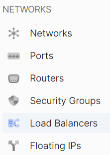
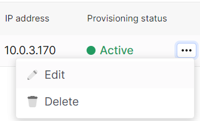
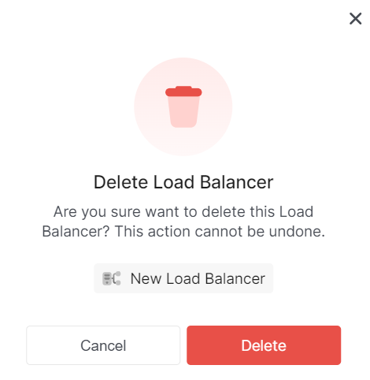

# Delete load balancer

1. Go to the section **Load Balancers**.

2. Select the desired load balancer, click on the ellipsis in the load balancer field, and choose **Delete** from the context menu.

3. In the deletion window, click **Delete**.

