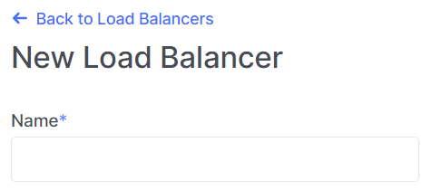

# Edit load balancer

1. Go to the section **Load Balancers**.

2. Select the desired load balancer, click on the ellipsis in the load balancer field, and choose **Edit** from the context menu.

3. Change the load balancer name in the **Name** field.

4. Optionally, you can edit the load balancer description in the **Description** field.

5. You can also toggle the activity status ("Enabled" | "Disabled") of the load balancer as needed.

6. After making all the necessary changes, click **Edit**.

