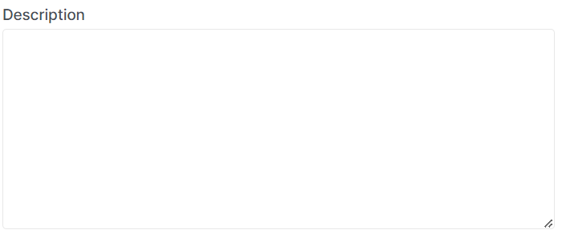

# Edit load balancer

import Tabs from '@theme/Tabs';
import TabItem from '@theme/TabItem';

<Tabs>
<TabItem value="personal-area" label="Personal Area" default>

1. Go to the section **Load Balancers**.


2. Select the desired load balancer, click on the ellipsis in the load balancer field, and choose **Edit** from the context menu.


3. Change the load balancer name in the **Name** field.


4. Optionally, you can edit the load balancer description in the **Description** field.



5. You can also toggle the activity status ("Enabled" | "Disabled") of the load balancer as needed.


6. After making all the necessary changes, click **Edit**.


</TabItem>
<TabItem value="openstack" label="Openstack CLI">

Make sure the OpenStack client is [installed](#) and you can [authenticate](#) to use it.
Execute the required commands.

```
openstack loadbalancer set --enable | --disable / 
                           --name <name> / 
                           --description <description> / 
                           <load_balancer>
```

`--enable` - Enable load balancer.

`--disable` - Disable load balancer.

`--name <name>` - Set load balancer name.

`--description <description>` - Set load balancer description.

`<load_balancer>` - Name or UUID of the load balancer to update.

</TabItem>
</Tabs>
