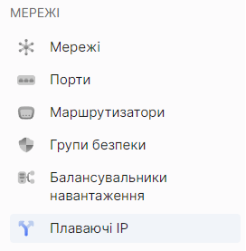
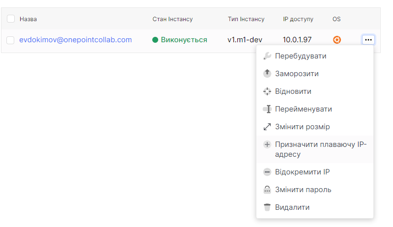
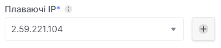
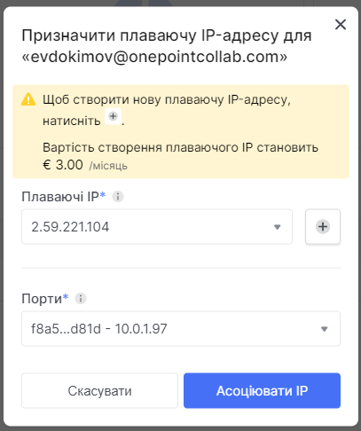
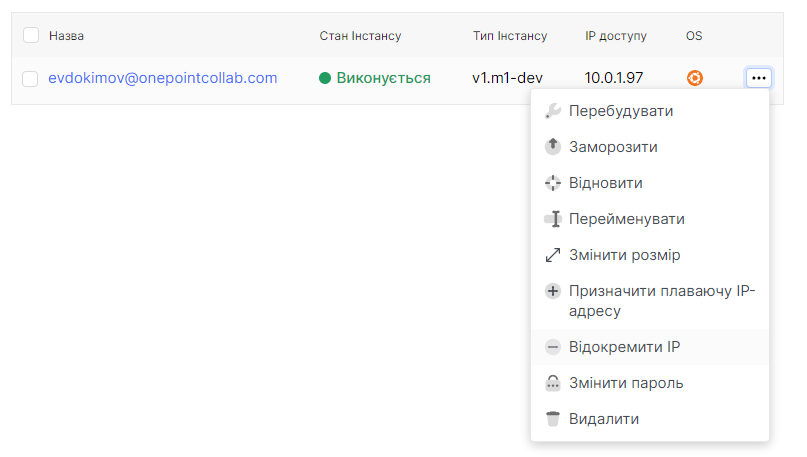
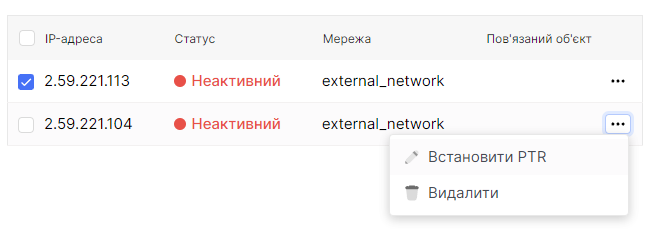
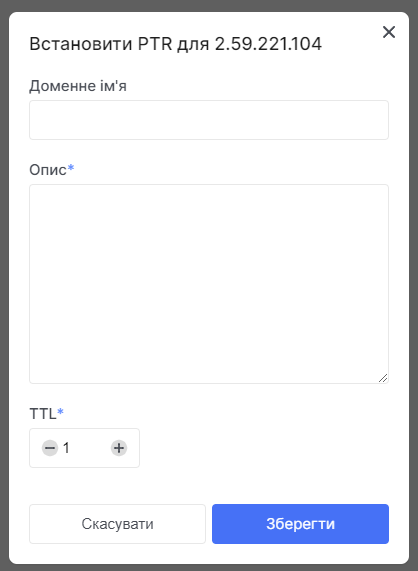

# Floating IP Management

 

## Viewing a List of Floating IP Addresses.
1. Using the sidebar, navigate to the **Floating IPs** section.

2. You will see a list of existing floating IPs.

 

## Assigning a Floating IP Address Without Prior Creation.
1. Using the sidebar, navigate to the Instances section.

2. Use the ellipsis (...) in the instance field to expand the context menu for interacting with the instance.
In the context menu, select the **Associate floating IP address section**.

3. Click the + symbol next to the dropdown menu under "Floating IPs" to create a new floating IP address.

4. Wait for a notification indicating the successful creation of the floating IP address.

5. In the first dropdown list, under the title **Floating IPs**, select the required floating IP address.
In the second dropdown list, under the title **Ports**, choose the necessary available port.

6.  Press the **Associate IP** button.

 

## Assign the floating IP address from the previous creation.
1. Using the sidebar, navigate to the **Instances** section.

2. Використайте трьохкрапку, у полі інстанса, для розвертання контекстного меню, для взаімодії з інстансом. 
У контекстному меню оберіть розділ **Призначити плавуючу IP-адресу**.

5. Use the ellipsis (...) in the instance field to expand the context menu for interacting with the instance. In the context menu, select the **Assign floating IP address** section.

6.  Press the **Associate IP** button.

 

## Detach the floating IP address.
1. Using the sidebar, navigate to the **Instances** section.

2. Use the ellipsis (...) in the instance field to expand the context menu for interacting with the instance. In the context menu, select the **detach floating IP address** section.

 

## Setting up PTR
1. Using the sidebar, navigate to the **Floating IPs** section.

2. 
In the floating IP address field, click on the ellipsis (...). In the context menu, select the **set PTR** section.

5. Set the domain name in the appropriate field.
6. Add additional information in the field labeled **description**.
7. Choose the time to live in the TTL field.
8. Press the **Save** button.

