# Port management.

You can manage ports: view, add, edit, and delete them.

## View the list of ports in the network.

1. Go to **Network**.

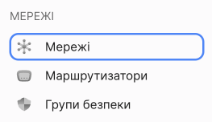

You will see a list of networks.

2. Click on the name of the network you need.

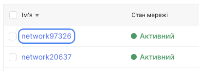

A page with detailed information about the network will open.

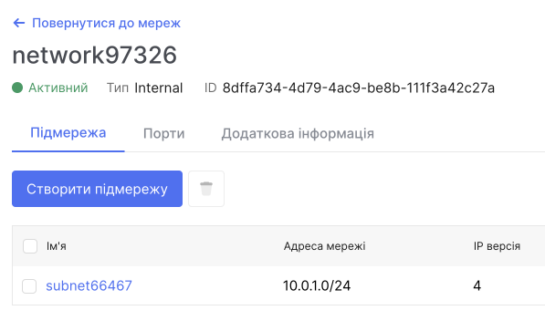

3. Go to the **Ports** tab.

A list of ports will be displayed.

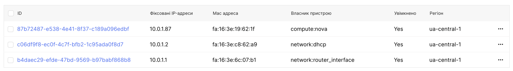

## View the list of ports attached to the instance.

1. Go to **Instances**.

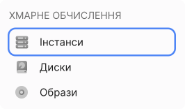

You will see a list of instances.

2. Click on the name of the instance you need.

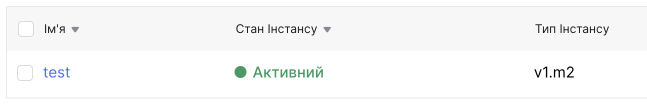

A page with detailed information about it will open.

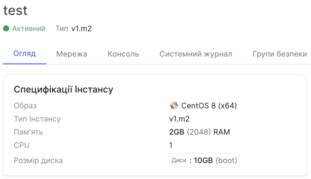

3. Go to the **Network** tab.

You will see a list of ports connected to this instance.

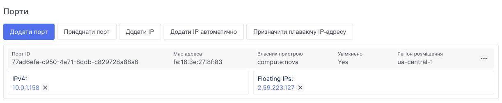

## Adding a port to the instance

1. Go to Instances.

You will see a list of instances.

2. Click on the name of the instance you need.

A page with detailed information about it will open.

3. Go to the **Network** tab.

You will see a list of ports connected to this instance.

4. Click on **Add Port**.

5. Choose the network and subnet in which you want to add the port.

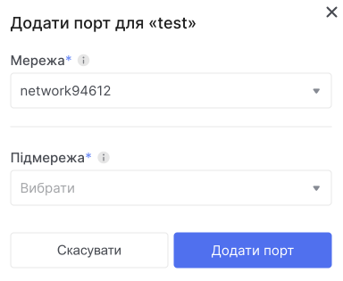

6. Click on **Add Port**.

## Port Deletion

> :warning: **You cannot delete a port if it is being used by a router.**

1. Go to **Network**.

A list of networks will be displayed.

2. Click on the name of the network you need.

A page with detailed information about the network will open.

3. Go to the **Ports** tab.

Delete the port using one of the following methods:

Using checkboxes:

- Select the desired port using the checkbox.

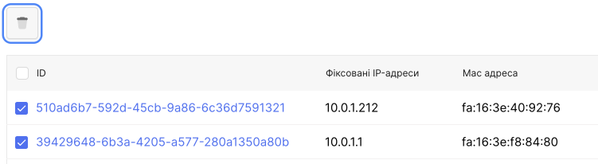

- Click the **Delete** button.

- Confirm the operation.

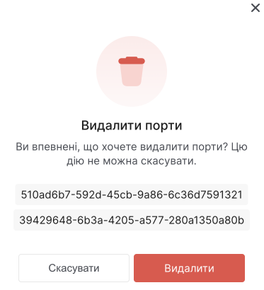

Using the context menu:

- Expand the menu of the port you want to delete, then select the **Delete port** option.

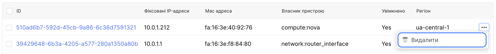

- Confirm the operation.

## Disconnect the port.

1. Go to **Instances**.

You will see a list of instances.

2. Click on the name of the instance you need.

A page with detailed information about the instance will open.

3. Go to the **Network** tab.

You will see a list of connected ports for this instance.

By using the context menu:

- Expand the menu of the port you need and select **Disconnect Port**.

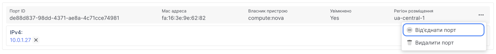

- Підтвердіть виконання операції.

## Confirm the operation.

1. Go to **Instances**.

You will see a list of instances.

2. Click on the name of the instance you need.

A page with detailed information about the instance will open.

3. Go to the **Мережа** tab.

You will see a list of ports connected to this instance.

4. Click the **Attach Port** button.

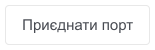

5. Select the port you want to attach.

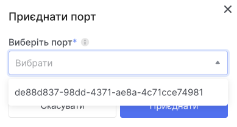

6. Click the **Attach** button.