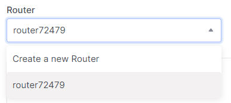
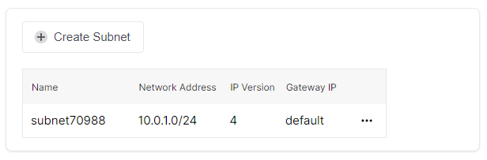

# Create Network

1.Go to **Networks**.

2. Click **Create Network**.

3. Enter the network name.

4. (Optional) Provide internet access. This is necessary if you plan to use VPN or SNAT services.

5. Choose from the provided list of routers.

6. By default, a subnet is already created, but you can add more if needed. If you want to add subnets later, you can skip this step.

7. Click **Create**.

After creating the network, it will appear in the general list of networks.