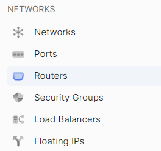
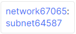
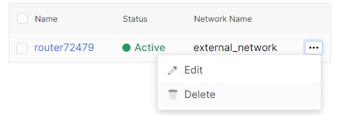

# Delete Network

To delete a network, you should first remove the associations with interfaces in routers, the routers themselves, the ports within the networks, and only then delete the network.
1. Go to **Networks**.

You will see a list of networks. Remember the name of the network you want to delete.

## Remove interfaces in Routers

2. Go to **Routers**.

In the list, click on the name of the router that is attached to the network.

A page with detailed information about the router will open, including the network to which the router is attached.

3. Go to the **Interfaces** tab.

4. Select all interfaces in this router and click the **Delete** button.

5. In the confirmation window, click the **Видалити** button.

## Delete the Router

6. Go back to the list of routers and in the context menu of the router you want to delete, select the **Delete** action.

7. In the confirmation window, click the **Delete** button.

## Delete ports in the Network

1. Return to the list of networks and click on the name of the network you want to delete.

2. Go to the **Ports** tab. 

3. Select all ports in this network and click the **Delete** button.

4. In the confirmation window, click the **Delete** button.

## Delete the Network

5. Go back to the list of networks and in the context menu of the network you want to delete, select the **Delete** action.

6. In the confirmation window, click the **Delete** button.

