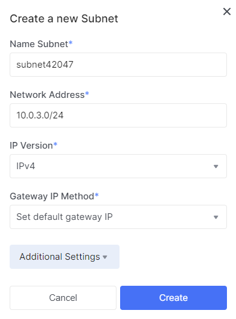
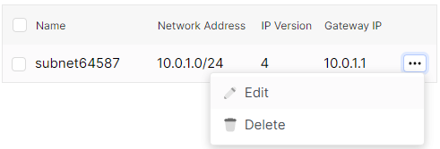
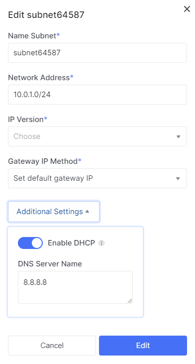
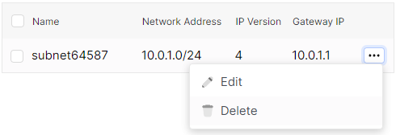
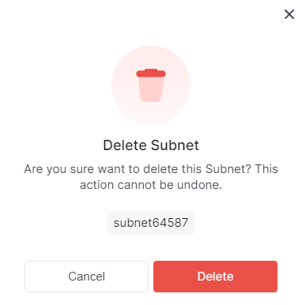

# Manage subnet

## Creating a Subnet

1. Go to **Network**.

2. In the list of networks, find the network you need and click on the name of the network in which you want to create a subnet.

3. Click the **Create Subnet** button.

- Specify the name of the subnet.

- Enter the IP address, IP version, and subnet gateway.

- In additional settings, you can configure DHCP (optional). By default, DHCP is enabled. Addresses issued by the DHCP server will remain static. Disabling DHCP will cause the IP addresses issued by the DHCP service to no longer be serviced. This can result in virtual machines going offline. If necessary, you can turn it off.

- Specify the DHCP IP address pool.

- Click the **Create** button.

## Edit a subnet

1. Go to **Network**.

2. Find the necessary network in the list and click on the network's name in which you need to edit a subnet.

3. Click on the name of the subnet you want to edit.

## Subnet Deletion

1. Go to **Network**.

2. In the list of networks, find the network you need and click on the network's name in which you want to delete a subnet.

3. Expand the context menu of the subnet you want to delete.

4. Select the **Delete** action.

