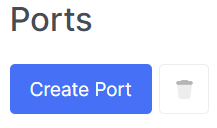
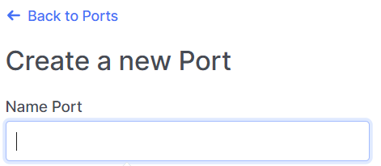
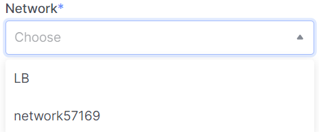
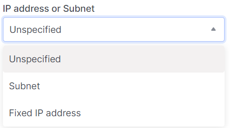
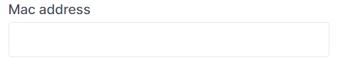
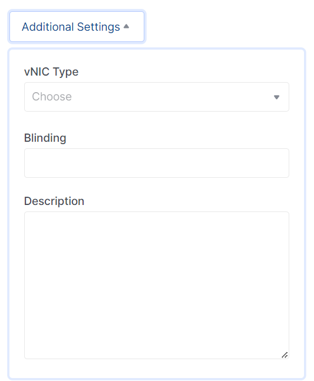

# Create port

import Tabs from '@theme/Tabs';
import TabItem from '@theme/TabItem';

<Tabs>
<TabItem value="personal-area" label="Personal Area" default>

1. Go to the **Ports** subsection.


2. Click on **Create Port**.



3. Enter the name of the future port in the **Port Name** field.



4. Choose the network in the **Network** field.



5. Save default value the port enabled or disable it.


6. Select what the port will be bound to. If you specify a subnet, OpenStack Networking allocates an available IP address from this subnet to the port. If you specify an IP address, OpenStack Networking attempts to assign the IP address if it is valid for any of the subnets in the specified network.



7. Specify the MAC address of the port. If not specified, the MAC address is generated automatically.

   

8. If port isolation is the goal, leave the field unchanged.


9. Save default value it enabled if you want to add a default security group.


10. Click on **Additional Settings** to expand the list of additional setting fields, which include vNIC type, binding, description, among others.



11. Click **Create**.


</TabItem>
<TabItem value="openstack" label="Openstack CLI">

Make sure the OpenStack client is installed and you can authenticate to use it.
Execute the necessary commands.

```
openstack port create --network <network> /
    [--description <description>] /
    [--mac-address <mac-address>] /
    [--vnic-type <vnic-type>] /
    [--fixed-ip subnet=<subnet>,ip-address=<ip-address> | --no-fixed-ip] /
    [--enable | --disable] /
    [--security-group <security-group> | --no-security-group] /
    [--enable-port-security | --disable-port-security] /
    [--allowed-address ip-address=<ip-address>[,mac-address=<mac-address>]] /
    <name>        
```

`--network <network>` - The network to which this port belongs (name or ID).

`--mac-address <mac_address>` - The MAC address of this port (admin only).

`--vnic-type <vnic-type>` - vNIC type for this port (direct | direct-physical | macvtap | normal | baremetal | virtio-forwarder, default: normal).

`--fixed-ip subnet=< subnet >,ip-address=<ip_address>` - Desired IP address and/or subnet for this port (name or ID): subnet=< subnet >,ip-address=<ip_address> (repeat the option to set multiple fixed IP addresses).

`--enable` - Enable port (default).

`--disable` - Disable port.

`--security-group <security-group>` - Security group to associate with this port (name or ID) (repeat option to set multiple security groups).

`--no-security-group` - Associate no security groups with this port.

`--enable-port-security` - Enable port security for this port (Default).

`--disable-port-security` - Disable port security for this port.

`--allowed-address ip-address=<ip_address>[,mac-address=<mac_address>]` - Add allowed-address pair associated with this port: ip-address=<ip_address>[,mac-address=< <mac_address> >] (repeat option to set multiple allowed-address pairs).

`name` - Назва цього порту.

</TabItem>
</Tabs>
