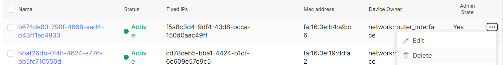
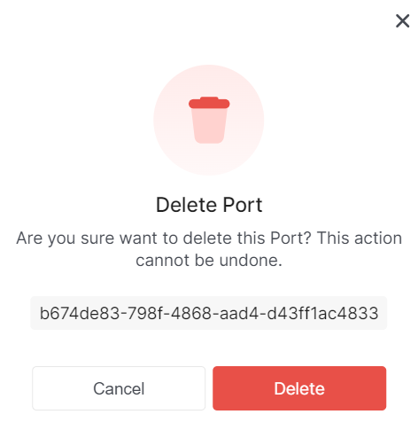

import Tabs from '@theme/Tabs';
import TabItem from '@theme/TabItem';

# Delete port

<Tabs>
<TabItem value="personal-area" label="Personal Area" default>

1. Go to the **Ports** subsection.


2. Select the necessary port, click on the ellipsis in the port field, and choose **Delete** from the context menu.



3. In the deletion window, click **Delete**.



</TabItem>
<TabItem value="openstack" label="Openstack CLI">

Make sure the OpenStack client is installed and you can authenticate to use it.
Execute the necessary commands.

```
openstack port delete <port>
```

`port` - Port to delete (name or ID)

</TabItem>
</Tabs>