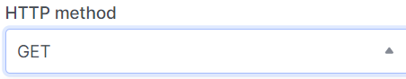

# Edit port

import Tabs from '@theme/Tabs';
import TabItem from '@theme/TabItem';

<Tabs>
<TabItem value="personal-area" label="Personal Area" default>

1. ПGo to the **Ports** subsection.


2. Select the necessary port, click on the ellipsis in the port field, and choose **Edit** from the context menu.


3. If necessary, change the name of the port in the **Name Port** field.


4. You can also change the activity status ("enabled" | "disabled") of the port.


5. You can edit the field corresponding to the port's origin, if necessary.


6. You can add or delete IP addresses for the port in the **IP Addresses** field.


7. There is an option to edit the **MAC Address** field.


8. Port security editing is available in the **Port Security** field.


9. Changing the vNIC type is available in the field of the same name.


10. Editing the description is available in the field of the same name.



11. After making all the necessary changes, click Edit.


</TabItem>
<TabItem value="openstack" label="Openstack CLI">

Make sure the OpenStack client is installed and you can authenticate to use it.
Execute the necessary commands.

```
openstack port create
    [--description <description>] /
    [--mac-address <mac-address>] /
    [--vnic-type <vnic-type>] /
    [--fixed-ip subnet=<subnet>,ip-address=<ip-address> | --no-fixed-ip] /
    [--enable | --disable] /
    [--security-group <security-group> | --no-security-group] /
    [--enable-port-security | --disable-port-security] /
    [--allowed-address ip-address=<ip-address>[,mac-address=<mac-address>]] /
    [--name <name>]
    <port>        
```


`--mac-address <mac-address>` - The MAC address of this port (admin only).

`--vnic-type <vnic-type>` - vNIC type for this port (direct | direct-physical | macvtap | normal | baremetal | virtio-forwarder, default: normal).

`--fixed-ip subnet=< subnet >,ip-address=<ip_address>` - Desired IP address and/or subnet for this port (name or ID): subnet=< subnet >,ip-address=<ip_address> (repeat the option to set multiple fixed IP addresses).

`--enable` - Enable port (default).

`--disable` - Disable port.

`--security-group <security-group>` - Security group to associate with this port (name or ID) (repeat option to set multiple security groups).

`--no-security-group` - Associate no security groups with this port.

`--enable-port-security` - Enable port security for this port (Default).

`--disable-port-security` - Disable port security for this port.

`--allowed-address ip-address=<ip_address>[,mac-address=< mac_address >]` - Add allowed-address pair associated with this port: ip-address=<ip_address>[,mac-address=< mac_address >] (repeat option to set multiple allowed-address pairs).

`--name <name>` - Set port name

`port` - Port to delete (name or ID)


</TabItem>
</Tabs>
