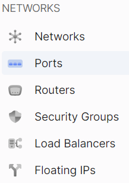

# General information

import Tabs from '@theme/Tabs';
import TabItem from '@theme/TabItem';

<Tabs>
<TabItem value="personal-area" label="Personal Area" default>


1. Go to the **Ports** subsection.



2. Select the necessary port and click on its name.


3. This page displays detailed information about the port and allows you to edit and delete it.


</TabItem>
<TabItem value="openstack" label="Openstack CLI">

Make sure the OpenStack client is installed and you can authenticate to use it.
Execute the necessary commands.

```
openstack port show <port>
```

`port` - Port to show (name or ID)

</TabItem>
</Tabs>
