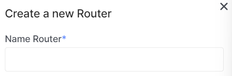
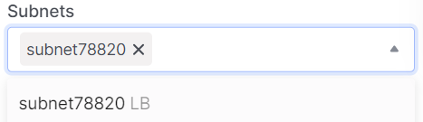

# Create a Router

import Tabs from '@theme/Tabs';
import TabItem from '@theme/TabItem';

<Tabs>
<TabItem value="personal-area" label="Personal Area" default>

1. Go to the **Routers** section.


2. Click on **Create Router**.


3. Enter the name of the future router in the **Name Router** field.



4. Allow or deny the router's access to the internet using the **Internet Access** switch. It is enabled by default.


5. Choose a subnet from the existing ones, or leave the field empty to create a router without interfaces. You can add interfaces at any time.



6. Select the router's state as "enabled" or "disabled." It is set to "enabled" by default.


7. Click **Create**.


</TabItem>
<TabItem value="openstack" label="Openstack CLI">

Make sure the OpenStack client is [installed](#) and you can [authenticate](#) to use it.
Execute the necessary commands.

```
openstack router create --enable | --disable / <name>          
```

`--enable` - Enable the router (default).

`--disable` - Disable the router.

</TabItem>
</Tabs>
