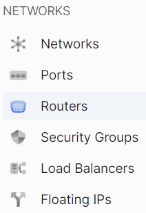
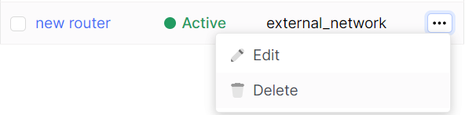
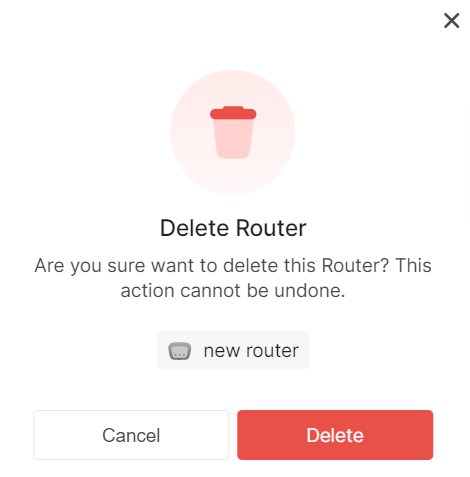

import Tabs from '@theme/Tabs';
import TabItem from '@theme/TabItem';

# Delete router

<Tabs>
<TabItem value="personal-area" label="Personal Area" default>

1. Go to the **Routers** subsection.



2. Select the necessary router, click on the ellipsis in the router field, and choose **Delete** from the context menu.


3. In the delete window, click **Delete**.



</TabItem>
<TabItem value="openstack" label="Openstack CLI">

Make sure the OpenStack client is installed and you can authenticate to use it.
Execute the necessary commands.

```
openstack router delete <router-name>
```

</TabItem>
</Tabs>