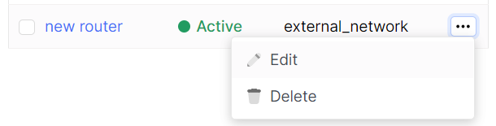
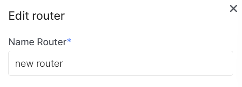

# Edit Router

import Tabs from '@theme/Tabs';
import TabItem from '@theme/TabItem';

<Tabs>
<TabItem value="personal-area" label="Personal Area" default>

1. Go to the **Routers** subsection.


2. Select the necessary router, click on the ellipsis in the router field, and choose **Edit** from the context menu.



3. If necessary, change the name of the router in the **Name Router** field.



4. If necessary, you can change the status of the router.


5. Click **Update**.


</TabItem>
<TabItem value="openstack" label="Openstack CLI">

Make sure the OpenStack client is installed and you can authenticate to use it. Execute the necessary commands.

```
openstack router set --name <name> / 
                     --enable | --disable / 
                     --route destination=<subnet>, gateway=<ip-address>
                     --fixed-ip subnet=<subnet>,ip-address=<ip-address>
```

`--name <new-name>` - Set the name of the router.

`--enable` - Enable the router.

`--disable` - Disable the router.

`--route destination=<subnet>, gateway=<ip-address>` - Add routes to the router's destination: destination subnet (in CIDR notation), gateway: IP address of the next hop (repeat the option to add multiple routes). This is deprecated in favor of 'router add/remove route' as it is subject to race conditions between concurrent clients unless used in conjunction with the --no-route option to overwrite the current 'routes' value.

</TabItem>
</Tabs>
