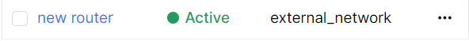
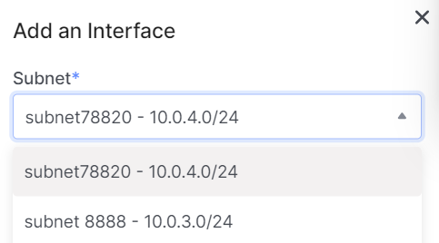
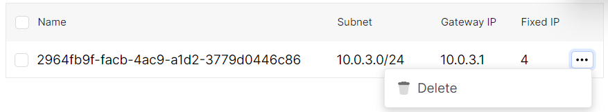
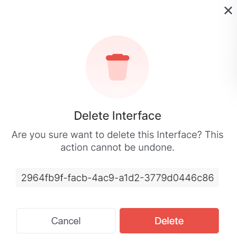

# General Information
1. Go to the **Routers** subsection.


2. Select the necessary router, and click on its name.



This page displays detailed information about the router.


# Add Interface

import Tabs from '@theme/Tabs';
import TabItem from '@theme/TabItem';

<Tabs>
<TabItem value="personal-area" label="Personal Area" default>

1. Go to the **Routers** subsection.


2. Select the necessary router, and click on its name.


3. Go to the **Interfaces** section. Click **Add Interface**.


4. Select the subnet for the interface in the **Subnet** field.



5. Specify the IP address of the interface in the **IP** field.


6. Click the **Add** button.


</TabItem>
<TabItem value="openstack" label="Openstack CLI">

Make sure the OpenStack client is installed and you can authenticate to use it. Execute the necessary commands.

```
openstack router add route --route destination=<subnet>,gateway=<ip-address> <router>
```

`--route destination=<subnet>,gateway=<ip-address>` - Add extra static route to the router. destination: destination subnet (in CIDR notation), gateway: nexthop IP address. Repeat option to add multiple routes. Trying to add a route that’s already present (exactly, including destination and nexthop) in the routing table is allowed and is considered a successful operation.

`router` - Router to which extra static routes will be added (name or ID).

</TabItem>
</Tabs>

# Delete Interface

<Tabs>
<TabItem value="personal-area" label="Personal Area" default>

1. Go to the **Routers** subsection.


2. Select the necessary router, and click on its name.


3. Go to the **Interfaces** section.


4. Select the desired interface, click on the ellipsis in the interface field, and choose **Delete** from the context menu.



5. In the deletion window, select **Delete**.



</TabItem>
<TabItem value="openstack" label="Openstack CLI">

Make sure the OpenStack client is installed and you can authenticate to use it. Execute the necessary commands.

```
openstack router remove route --route destination=<subnet>,gateway=<ip-address> <router>
```

`--route destination=<subnet>,gateway=<ip-address>` - Remove extra static route from the router. destination: destination subnet (in CIDR notation), gateway: nexthop IP address. Repeat option to remove multiple routes. Trying to remove a route that’s already missing (fully, including destination and nexthop) from the routing table is allowed and is considered a successful operation.

`router` - Router to which extra static routes will be added (name or ID).

</TabItem>
</Tabs>