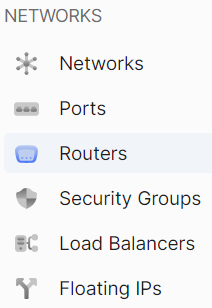

# Загальна інформація
1. Перейдіть до підрозділу **Маршрутизатори**.



2. Оберіть необхідний маршрутизатор, та натисніть на його ім'я (назву).


На даній сторінці зображена детальна інформація по маршрутизатору.


# Додати інтерфейс

import Tabs from '@theme/Tabs';
import TabItem from '@theme/TabItem';

<Tabs>
<TabItem value="personal-area" label="Personal Area" default>

1. Перейдіть до підрозділу **Маршрутизатори**.


2. Оберіть необхідний маршрутизатор, та натисніть на його ім'я (назву).


3. Перейдіть до розділу **Інтерфейси**. Та натисніть на **Додати інтерфейс**.


4. Оберіть підмережу для інтерфейсу у полі **Підмережа**.


5. Оберіть IP адрес у полі **IP**.


6. Натисніть на кнопку **Додати**.


</TabItem>
<TabItem value="openstack" label="Openstack CLI">

Переконайтеся, що клієнт OpenStack [встановлений](#) і ви можете [авторизуватись](#) для його використання. Виконайте потрібні команди.    

```
openstack router add subnet <router> <subnet-name> | <subnet-id>
```

`<subnet-name> | <subnet-id>` - Добавить подсеть по имени или id

`router` - Маршрутизатор, к которому будет добавлена подсеть (имя или идентификатор)

</TabItem>
</Tabs>

<Tabs>
<TabItem value="personal-area" label="Personal Area" default>

# Видалити інтерфейс

1. Перейдіть до підрозділу **Маршрутизатори**.


2. Оберіть необхідний маршрутизатор, та натисніть на його ім'я (назву).


3. Перейдіть до розділу **Інтерфейси**.


4. Оберіть необхідне інтерфейс, натисніть на трьокрапку у полі інтерфейса,та у контекстному меню виберіть **Видалити**.


5. У вікні видалення оберіть **Видалити**.


</TabItem>
<TabItem value="openstack" label="Openstack CLI">

Переконайтеся, що клієнт OpenStack [встановлений](#) і ви можете [авторизуватись](#) для його використання. Виконайте потрібні команди.    

```
openstack router remove subnet <router> <subnet-name> | <subnet-id>
```

`<subnet-name> | <subnet-id>` - Добавить подсеть по имени или id

`router` - Маршрутизатор, к которому будет добавлена подсеть (имя или идентификатор)

</TabItem>
</Tabs>