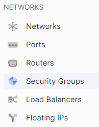

# Add a Rule

import Tabs from '@theme/Tabs';
import TabItem from '@theme/TabItem';

<Tabs>
<TabItem value="personal-area" label="Personal Area" default>

1. Navigate to the **Security Groups** section.



2. Select the desired security group, click on the three dots in the security group field, and choose **Add Rule** from the context menu.


3. Choose the protocol of the rule in the **Rule Protocol** field.


4. Select the direction of the rule in the **Direction** field.


5. Specify the range of IP addresses in the **CIDR** field.


6. Optionally, add a description for the rule in the **Description** field.


7. Click **Create**.


</TabItem>
<TabItem value="openstack" label="Openstack CLI">

Make sure that the OpenStack client is installed and you are able to authenticate to use it. Execute the necessary commands.
    
```
openstack security group rule create --remote-ip <ip-address> /
                                     --protocol <protocol> /
                                     --description <description> /
                                     --ingress /
                                     --egress /
                                     <security-group-name>    
```

`--remote-ip` - Remote IP address block (may use CIDR notation; default for IPv4 rule: 0.0.0.0/0)
`--protocol` - IP protocol (ah, dccp, egp, esp, gre, icmp, igmp, ipv6-encap, ipv6-frag, ipv6-icmp, ipv6-nonxt, ipv6-opts, ipv6-route, ospf, pgm, rsvp, sctp, tcp, udp, udplite, vrrp and integer representations [0-255]; default: tcp)
`--ingress` - Rule applies to incoming network traffic (default)
`--egress` - Rule applies to outgoing network traffic

</TabItem>
</Tabs>

<Tabs>
<TabItem value="personal-area" label="Personal Area" default>

# Delete a Rule

1. Go to the **Security Groups** section.


2. Click on the name of the desired security group.


3. The detailed information page will display a list of rules.


4. Select the rule you want to delete, click on the three dots in the rule field, and choose **Delete** from the context menu.


5. In the delete window, select **Delete**.


</TabItem>
<TabItem value="openstack" label="Openstack CLI">

Make sure that the OpenStack client is installed and you are able to authenticate to use it. Execute the necessary commands.
    
```
openstack security group rule delete <rule>
```

</TabItem>
</Tabs>
