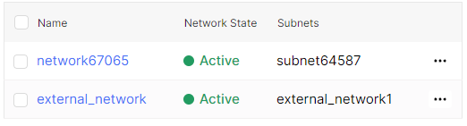
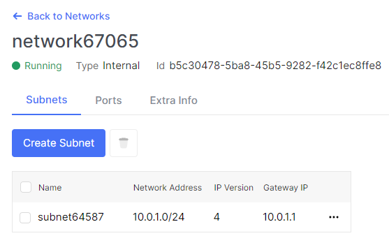

# View the list of networks and subnetworks

1. Go to **Network**.

A list of networks will be displayed.

2. Click on the name of the network you need.

A page with detailed information about it will open, including a list of subnets in this network.

