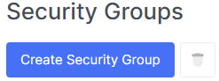
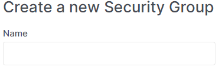
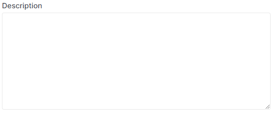

# Creating a Security Group

import Tabs from '@theme/Tabs';
import TabItem from '@theme/TabItem';

<Tabs>
<TabItem value="personal-area" label="Personal Area" default>

1. Go to the **Security Groups** section.


2. Click on **Create Security Group**.



3. Enter the name for your future security group in the **Name** field.



4. You can provide additional description for the security group in the **Description** field.



5. Click on the create button.


</TabItem>
<TabItem value="openstack" label="Openstack CLI">

Make sure that the OpenStack client is installed and you are able to authenticate to use it. Execute the necessary commands.
    
```
openstack security group create --description <description> <security-group-name>
```

`--description <description>` - Security group description.
`<security-group-name>` - New security group name.

</TabItem>
</Tabs>
