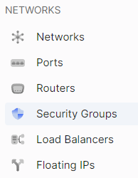
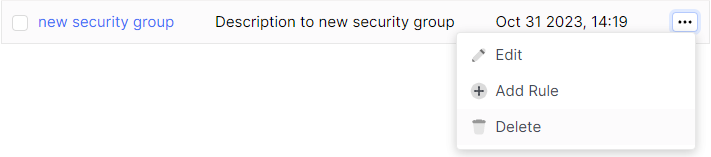
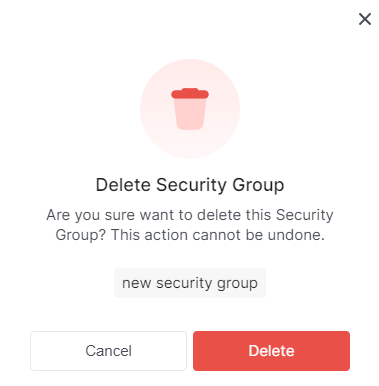

import Tabs from '@theme/Tabs';
import TabItem from '@theme/TabItem';

# Delete a Security Group

<Tabs>
<TabItem value="personal-area" label="Personal Area" default>

1. Go to the **Security Groups** section.



2. Select the desired security group, click on the three dots in the security group field, and choose **Delete** from the context menu.



3. In the delete window, click **Delete**.



</TabItem>
<TabItem value="openstack" label="Openstack CLI">

Make sure that the OpenStack client is installed and you are able to authenticate to use it. Execute the necessary commands.
    
```openstack security group delete <security-group-name>```

</TabItem>
</Tabs>
