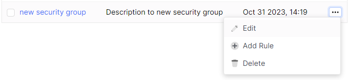
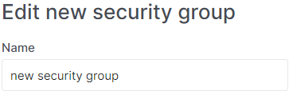
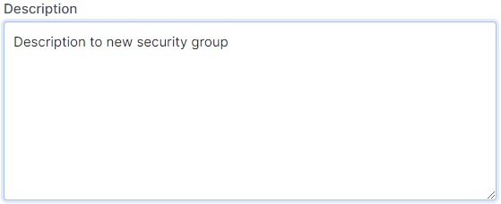

# Edit security groups

import Tabs from '@theme/Tabs';
import TabItem from '@theme/TabItem';

<Tabs>
<TabItem value="personal-area" label="Personal Area" default>

1. Go to the **Security Groups** section.


2. Select the desired security group, click on the three dots in the security group field, and choose **Edit** from the context menu.



3. Change the name of the future security group in the **Name** field.



4. Modify the additional description of the security group in the **Description** field.



5. Click **Save**.


</TabItem>
<TabItem value="openstack" label="Openstack CLI">

Make sure that the OpenStack client is installed and you are able to authenticate to use it. Execute the necessary commands.
    
```
openstack security group set --name <new-name> --description <description> <security-group-name>
```

`--name <new-name>` - New security group name.
`--description <description>` - New security group description.

</TabItem>
</Tabs>


