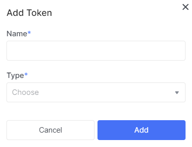
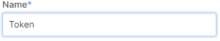
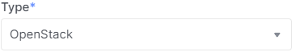

# OpenStack token

## Get OpenStack token

1. Go to [OpenStack token](https://console.ocplanet.cloud/account-settings/api-access) page.

2. Click **Add Token**.

3. In the modal window, enter the token name.

4. Among the provided types, select **OpenStack**.

5. Click **add**.

