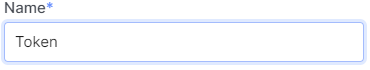

# OpenAPI token

## Get OpenAPI token

1. Go to [OpenAPIToken](https://console.ocplanet.cloud/account-settings/api-access) page.

2. Click **Add Token**.

3. In the modal window, enter the token name.

4. Among the provided types, select **OpenAPI**.

5. Click **Add**.

