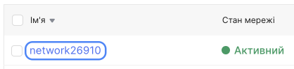
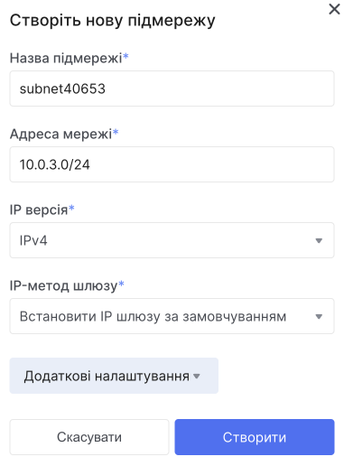
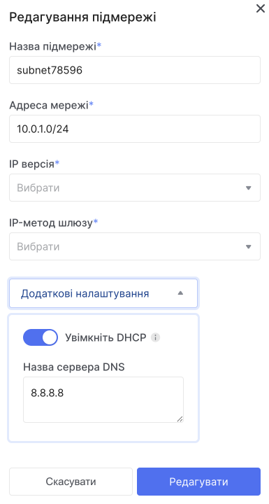
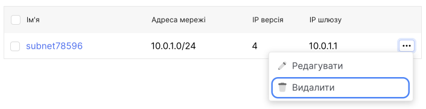
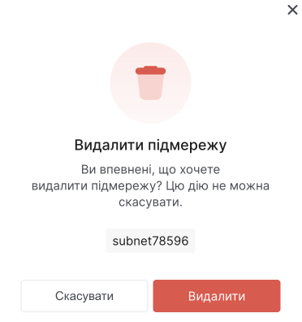

# Управління дисками

Система зберігання даних на платформі OneCloudPlanet організована за допомогою мережевих дисків. Конфігурація основного диска визначається на етапі створення віртуальної машини, додаткові диски можна створити пізніше і підключити до потрібних ВМ. Для створених дисків доступні операції зміни розміру та типу. Диски можна переміщати між проектами та віртуальними машинами, відключати від ВМ, робити завантажувальними та не завантажувальними. Можна видалити диски, які більше не використовуються.

## Перегляд списку мереж і підмереж і інформації про них

1. Перейдіть до **Мережі**.

Буде відображено список мереж.

2. Натисніть на назву потрібної мережі.

Відкриється сторінка з детальною інформацією про неї. У тому числі буде відображено список підмереж у цій мережі.

## Створення мережі

1. Перейдіть до **Мережі**.

2. Нажміть **Створити мережу**.

3. Введіть ім'я мережі.

4. (опціонально) Дайте доступ до Інтернету. Це необхідно, якщо ви плануєте скористатися сервісами VPN, SNAT.

5. Виберіть із запропонованого списку маршрутизатор.

6. За замовчуванням підмережа вже створена, але ви можете додати її ще. Якщо потрібно додати підмережі пізніше, пропустіть цей крок.

7. Натисніть **Створити**.

Після створення мережі вона з'явиться у загальному списку мереж.

## Редагування мережі

1. Перейдіть до **Мережі**.

**Через контекстне меню:**

- У списку мереж знайдіть потрібну мережу.

- Розгорніть контекстне меню мережи.

- Виберіть дію **Редагувати**.

Ви можете змінити ім'я та стан мережі.

## Видалення мережі

Для того, щоб видалити мережу, потрібно спочатку видалити прихильність до інтерфейсів в маршутизаторах, маршутизатори, порти в мережах і тільки потім мережу.

[Детальний гайд видалення мережі](/ua/control-panel/cloud-platform/networks/delete-network)

## Створення підмережі

1. Перейдіть до **Мережі**.

2. У списку мереж знайдіть потрібну мережу та натисніть назву мережі, в якій потрібно створити підмережу.

3. Натисніть кнопку **Створити підмережу**.

- Вкажіть назву підмережі.

- Введіть IP-адресу, IP версію та шлюз підмережі.

- У додаткових налаштуваннях, ви зможете налаштувати DHCP. (опційно) За замовчуванням DHCP увімкнено. Адреси, видані DHCP-сервером, залишатимуться постійними. Вимкнення DHCP призведе до того, що IP-адреси, видані DHCP-сервісом, перестануть обслуговуватися. Це може призвести до відсутності віртуальних машин. Якщо потрібно, вимкніть його.

- Вкажіть пул DHCP IP-адрес.

- Натисніть кнопку **Створити**.

## Редагування підмережі

1. Перейдіть до **Мережі**.

2. У списку мереж знайдіть потрібну мережу та натисніть назву мережі, в якій потрібно відредагувати підмережу.

3. Натисніть на назву підмережі яку ви хочете відредагувати.

## Видалення підмережі

1. Перейдіть до **Мережі**.

2. У списку мереж знайдіть потрібну мережу та натисніть назву мережі, в якій потрібно видалити підмережу.

4. Розгорніть контекстне меню підмережі яку потрібно видалити.

5. Виберіть дію **Видалити**.

