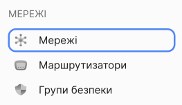
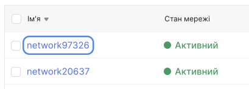
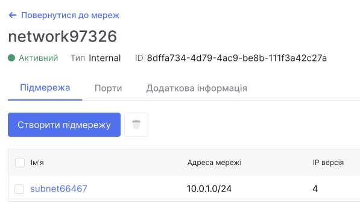

# Disk Management

Data storage on the OneCloudPlanet platform is organized using network disks. The configuration of the main disk is determined during the virtual machine's creation, and additional disks can be created later and connected to the required virtual machines. For created disks, you can perform operations like changing the size and type. Disks can be moved between projects and virtual machines, detached from virtual machines, made bootable or non-bootable, and deleted when they are no longer needed.

## Viewing the List of Networks and Subnets and Their Information

1. Go to **Network**.

You will see a list of networks.

2. Click on the name of the network you want to view.

A page with detailed information about the network will open, including a list of subnets in this network.

## Creating a Network

1. Go to **Network**

2. Click on **Create Network**.

3. Enter the name of the network.

4. (optional) Allow internet access. This is required if you plan to use VPN or SNAT services.

5. Choose from the provided list of routers.

6. By default, a subnet is already created, but you can add more if needed. If you need to add subnets later, you can skip this step.

7. Click **Create**.

After creating the network, it will appear in the list of networks.

## Editing a Network

1. Go to **Network**.

**Using the Context Menu:**

- In the list of networks, find the network you want to edit.

- Expand the context menu for that network.

- Select **Edit**.

You can change the network's name and state.

## Deleting a Network

To delete a network, you first need to remove the interfaces in routers, routers, and ports associated with the network.

[Detailed Guide on Deleting a Network](/control-panel/cloud-platform/networks/delete-network)

## Creating a Subnet

1. Go to **Network**.

2. In the list of networks, find the network where you want to create a subnet and click the name of that network.

3. Click the **Create Subnet** button.

- Provide a name for the subnet.

- Enter the IP address, IP version, and subnet gateway.

- In additional settings, you can configure DHCP. (Optional) DHCP is enabled by default. Addresses issued by the DHCP server will remain permanent. If you need to, you can disable it.

- Specify the DHCP IP address pool.

- Click **Create**.

## Editing a Subnet

1. Go to **Network**.

2. In the list of networks, find the network where you want to edit a subnet and click the name of that network.

3. Click the name of the subnet you want to edit.

## Deleting a Subnet

1. Go to **Network**.

2. In the list of networks, find the network where you want to delete a subnet and click the name of that network.

4. Expand the context menu for the subnet you want to delete.

5. Select **Delete**.

