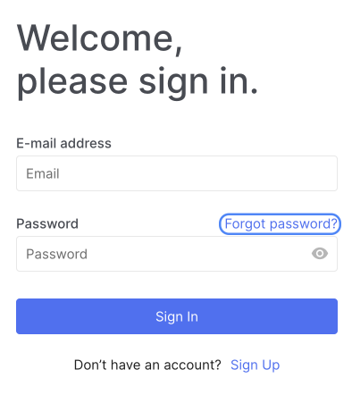
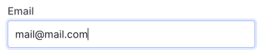
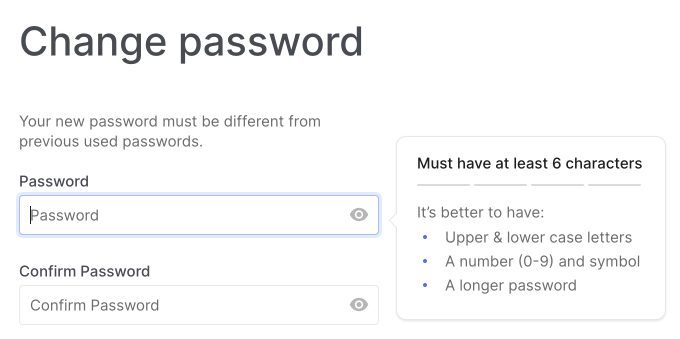

# Restoring access

If you have problems accessing your account, you can restore access:

- if you are an Account Owner, you can [request password reset](#request-password-reset), or [change email](#change-email-address). Also [turn off 2-Step Verification](./control-panel/personal-area/security#disable-2-step-verification-if-there-is-no-access-to-the-control-panel).

## Request password reset

A user with any role can reset the password.

If you have lost access to the email you used to register, please [change your email address](##).

If you encounter any problems during the registration process, write to the technical support service: [support@ocplanet.cloud](mailto:support@ocplanet.cloud).

1. On the [control panel](https://console.ocplanet.cloud/sign-in) login page, click **Forgot Password?**

2. Enter the email address you used during registration. 

3. Click "Request Password Reset".

4. We will send an email to the specified email address. In the email, click the link that leads to resetting your password. Password reset is active for one hour. You can only click on the reset password link once.

5. On the password reset page, enter a new password and confirm it.

6. Click **Change Password**

## Change Email Address

If you are not the Account Owner, contact the Account Owner - they should [remove you from the list of users](#) and [add a new user](#) with the correct data.

If you are the account owner, please contact [technical support](#).