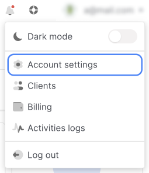
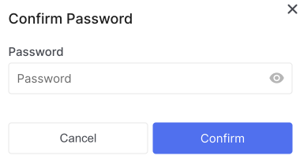
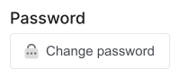
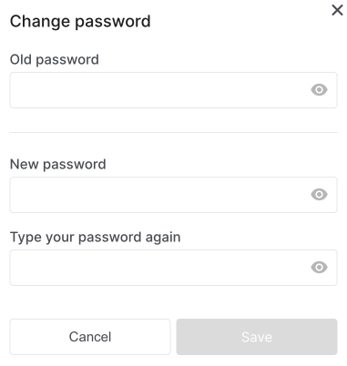
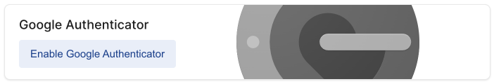
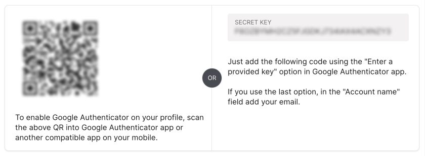
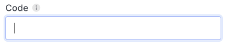
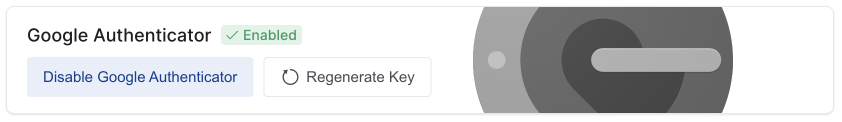

# Security

To keep your account secure, you can:

- [change password](#change-password) to the account;
- set up [two-step authentication](#).

## Change Password

If you have forgotten your account password, [restore it](./control-panel/personal-area/restoring-access).

1. In the control panel, open the drop-down list in the upper right corner and select **Account Settings**.

2. Go to section **Security**.

3. In the modal window that appears, enter the current password.

4. Click **Change Password**

5. Enter the old password, the new password and enter the new password again.

6. Click **Save**

## 2-Step Verification

With two-step authentication, you need to enter a password and a one-time verification code to enter your account. Two-step authentication is connected separately in the personal settings of the account.

You can connect a way to get a one-time verification code in the Google Authenticator app.

Only the Account Owner can disable 2-Step Verification in the control panel and re-enable it.

If you lose access to the device with the authenticator app, you can contact [tech support](#) to restore access to your account.

1. In the control panel, open the drop-down list in the upper right corner and select **Account Settings**.

2. Go to section **Security**.

3. In the modal window that appears, enter the current password.

4. Click **Enable Google Authenticator**

5. You will have the choice of connecting via a **QR code** or the ability to enter **SECRET KEY** yourself in the Google Authenticator application.

6. Enter the received code in the field **Code**

> :bulb: If **QR code** is not readable or **SECRET KEY** is not correct, press **Regenerate Key** to update. In the modal window, confirm that you agree with the code refresh and click the **Yes** button.

7. Click **Enable Google Authenticator**

## Disable 2-step verification if you have access to the control panel

Only the **Account Owner** can disable 2-Step Verification in the control panel.

1. In the control panel, open the drop-down list in the upper right corner and select **Account Settings**.

2. Go to section **Security**.

3. In the modal window that appears, enter the current password.

4. Click **Disable Google Authenticator**

> :bulb: If you have lost access to the Google Authenticator app, click **Regenerate Key**, confirm that you agree with the code refresh and click the **Yes** button.

## Disable 2-Step Verification if there is no access to the control panel

If you are not the Account Owner, contact the Account Owner - they should [remove you from the user list](#) and [add a new user](#) with the correct details.

If you are an Account Owner, please contact [tech support](#).