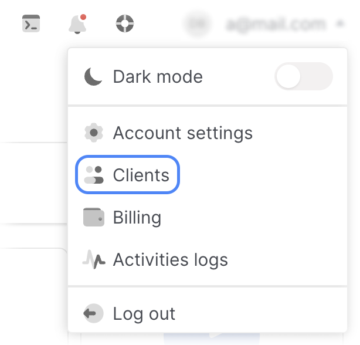
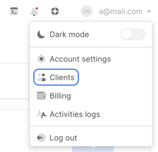

# Add User

Users can be added by the Account Owner and User Administrator.

1. In the control panel, open the drop-down list in the upper right corner and select Clients.

2. Follow the link **Your ID**.

3. Go to the **Users** tab.

4. Click **Invite User**.

5. Enter the user's email.

6. Select [user roles](##), you can select an unlimited number of them.

7. Optional: check the categories of notifications that will be sent to the user.

8. Click **Invite User**. The user will be added to the list on the **Users** tab, with the status **No Accepted Invite**.

9. The link for [registration by invitation](##) will be sent to the user's e-mail. The account is activated after confirmation of the mail and completion of registration.