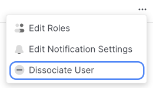
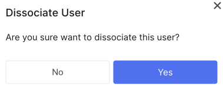

# Dissociate user

**Account Owner** and **User Admin** can delete users.

1. In the control panel, open the drop-down list in the upper right corner and select Clients.

2. Follow the link **Your ID**.

3. Go to the **Users** tab.

4. In the row of the desired user, press the (⋯) button.

5. Click **Dissociate user**.

6. In the modal window, click **Yes**.

