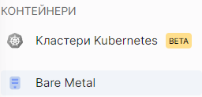
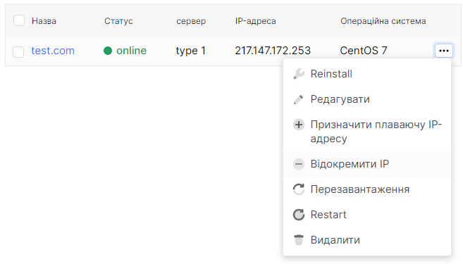
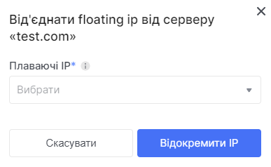
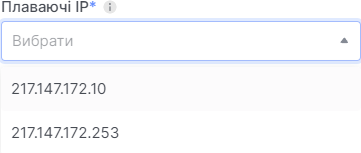
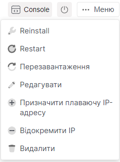

# Від'єднання Floating IP

1. Перейдіть до розділу **Bare Metal**.

2. Виберіть потрібний сервер, натисніть на три крапки в полі сервера та виберіть **Відокремити плавуючу IP-адресу** в контекстному меню.

3. Виберіть Floating IP сервера зі списку в полі під назвою **Плаваючі IP**.

4. Натисніть **Відокремити IP**, коли виберете необхідний Floating IP.

#### Ви можете зробити це на сторінці деталей сервера, натиснувши на три крапки з назвою **Меню** у верхньому правому куті.

