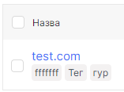
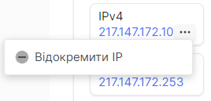

## Список Floating IP

1. Перейдіть до розділу Bare Metal.

2. Виберіть потрібний сервер і натисніть на його ім'я.

3. На цій сторінці відображаються всі пов'язані з сервером Floating IP.

 
 
 
 
 

## Призначити Floating IP на сторінці деталей сервера

1. Перейдіть до розділу **Bare Metal**.

2. Виберіть потрібний сервер і натисніть на його ім'я.

3. Натисніть **Додати Floating IP**.

4. Виберіть Floating IP для сервера зі списку в полі під назвою **Floating IPs**.

5. Натисніть **Додати IP**, коли виберете необхідний Floating IP.

 
 
 
 
 

## Відключити Floating IP на сторінці деталей сервера

1. Перейдіть до розділу **Bare Metal**.

2. Виберіть потрібний сервер і натисніть на його ім'я.

3. Виберіть потрібний Floating IP, натисніть на три крапки в полі сервера і виберіть **Відокремити IP** у контекстному меню.

4. Натисніть **Так** for для відключення IP.

